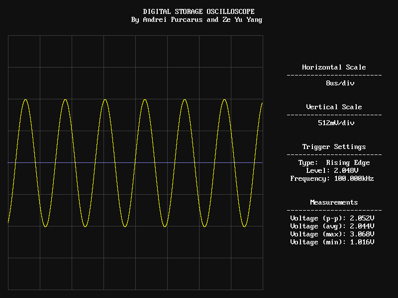

# Digital Storage Oscilloscope

An FPGA implementation of a digital storage oscilloscope targeting the DE1-SoC Cyclone V development board. This oscilloscope is capable of capturing a waveform using an ADC, processing it in real-time and displaying it on a VGA monitor. It uses sin(x)/x interpolation to extend the range of frequencies for which waveforms can be properly displayed to 200kHz for a 500kSa/s ADC. It also uses an internal frequency counter to measure the trigger frequency of waveforms with at most 0.26% error over a range of frequencies from 1kHz to 200kHz. In addition, it provides measurements of the peak-peak, average, max and min voltages of captured waveforms with an error of at most 1%+10mV using a 12-bit ADC whose range is 0.000V to 4.095V. See the [report](report/final-report/final-report.pdf) for more details.
